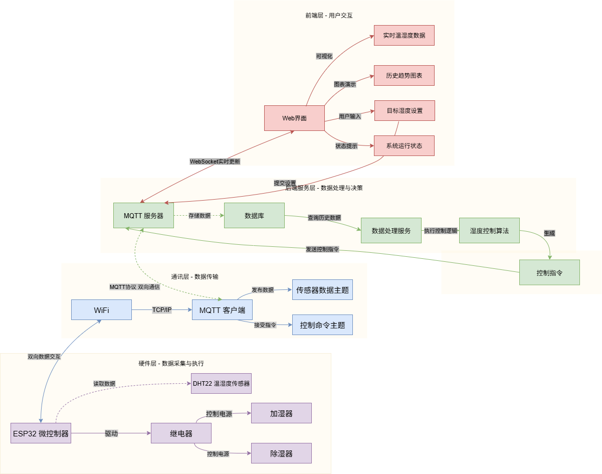
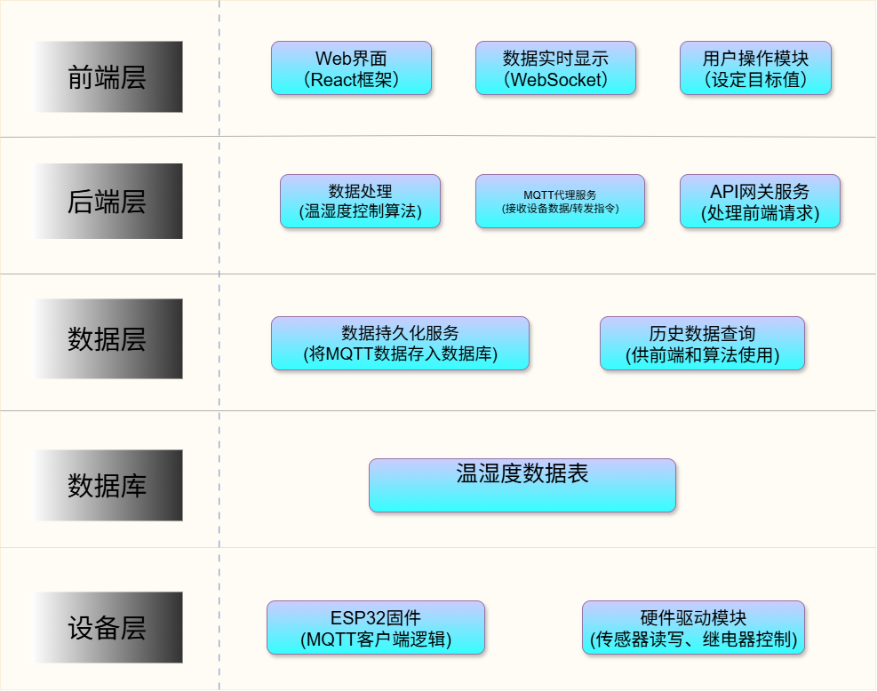

# 湿度控制系统架构设计

## 整体架构概述:
- 本湿度控制系统采用分层架构设计，包含四个主要层次：硬件层、通信层、后端服务层和前端层。

## 一、数据流图:

### 数据流程说明
1. **传感器数据采集流程**：
   - DHT22传感器采集温湿度数据
   - ESP32读取传感器数据并进行初步处理
   - 通过WiFi和MQTT协议将数据发送到后端服务
   - 数据存储到数据库并用于控制算法分析

2. **控制指令执行流程**：
   - 用户通过Web界面设置目标湿度
   - 后端服务根据当前湿度和目标湿度计算控制策略
   - 控制指令通过MQTT发送到硬件设备
   - ESP32执行指令控制加湿器/除湿器工作

3. **状态反馈流程**：
   - 硬件设备执行状态通过MQTT实时反馈
   - 后端服务更新系统状态
   - Web界面显示最新系统状态和执行结果

## 二、组件图:

### 核心组件说明
- **硬件层**：
  - **ESP32开发板**：负责与各类传感器和执行器进行交互。它读取DHT22传感器的温湿度数据，接收来自通信层的控制指令，控制加湿器和除湿器的工作状态。（同时还能控制LED灯等辅助设备。）
  - **DHT22传感器**：用于采集环境中的温度和湿度数据，将模拟信号转换为数字信号后传输给ESP32。
  - **加湿器和除湿器**：执行湿度调节的物理设备，根据ESP32发送的控制信号进行加湿或除湿操作。

- **通信层**：
  - **WiFi模块**：集成在ESP32中，负责建立与本地网络的连接，为数据传输提供网络基础。
  - **MQTT客户端**：运行在ESP32上，负责将传感器采集的数据发布到MQTT服务器，同时订阅来自后端服务的控制指令。
  - **MQTT服务器**：作为通信的中间枢纽，接收来自硬件设备的数据，转发给后端服务，同时将后端服务生成的控制指令推送给对应的硬件设备。

- **后端服务层**：
  - **数据处理模块**：接收来自通信层的传感器数据，进行数据清洗、格式转换等处理，然后将处理后的数据存储到数据库中。
  - **控制算法模块**：根据当前湿度和用户设定的目标湿度，运用PID控制算法或其他智能算法计算控制策略，生成相应的控制指令。
  - **用户管理模块**：处理用户的注册、登录、权限管理等功能，确保系统的安全性，防止未授权访问。
  - **API服务模块**：提供RESTful API接口，供前端层调用，实现数据的查询、用户设置的更新等功能。

- **前端层**：
  - **Web界面**：基于React框架开发，为用户提供直观的交互界面。用户可以在网页上实时查看当前环境的温度、湿度、目标湿度、设备状态等信息，还能手动调节目标湿度，开启或关闭加湿器和除湿器。
  - **实时数据展示组件**：通过WebSocket或长轮询的方式与后端服务保持实时通信，动态更新页面上的温湿度数据和设备状态。
  - **控制操作组件**：提供按钮和滑块等控件，方便用户进行手动操作和目标湿度的设置。

- **数据库**：
  - **关系型数据库（如MySQL）**：存储系统的用户信息、设备配置信息、历史温湿度数据等结构化数据。
  - **时间序列数据库（如InfluxDB）**：专门用于存储传感器采集的时序数据，便于进行数据分析和趋势预测。